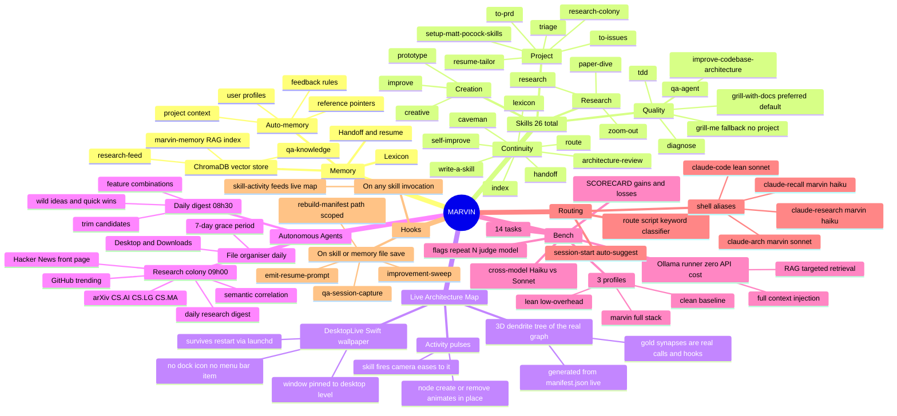

# MARVIN

> *"I could calculate your chances of survival, but you won't like it."*
> — Marvin, The Hitchhiker's Guide to the Galaxy

**MARVIN** is an open-source memory, routing, and skills layer for [Claude Code](https://claude.ai/code). Where Claude starts every session cold, MARVIN gives it persistent memory, 26 structured skills, autonomous background agents, a self-measuring bench, and automatic profile + model routing — so it finds the right knowledge, applies the right skill, runs on the cheapest viable model, and gets measurably better over time.

Named after the Hitchhiker's Guide's brilliant, underutilised android. This project is about making sure that brain gets used.

> **North star:** minimise token cost, maximise capability and quality. Every component earns its place through measurement, not intuition.

---

## What MARVIN Can Do



---

## Real-World Impact

Not "MARVIN exists" — concrete before/after evidence from real sessions. Every claim here links to something you can go verify yourself: a commit, an ADR, a live external contribution.

### Built a citation-graph knowledge base for [`paper-dive`](https://github.com/G-Eskayo/paper-dive), end to end

Since extracted into [its own repo](https://github.com/G-Eskayo/paper-dive) — a complete, independently useful capability that doesn't need MARVIN's other infrastructure, verified standalone before extraction (all 23 tests pass with zero MARVIN dependency).

Went from a one-line roadmap idea ("follow a paper's bibliography recursively") to a working, tested, deployed `/paper-graph` command — via 12 architecture-decision records ([`docs/adr/0007`–`0012`](docs/adr/)), strict TDD (23 tests, zero mocking of the actual scoring logic), and real verification against an unpublished paper, not just a synthetic test fixture.

Along the way, MARVIN caught and fixed three real bugs that would have shipped silently otherwise:
- A version conflict between `mlx-lm` and `transformers` that broke model loading — root-caused and patched, verified empirically rather than guessed at.
- A misdiagnosed "adapter not activated" warning in a widely-used ML library (`adapters`) that looked like a real functional bug — a direct embedding comparison proved the warning was a false positive, saving a costly fallback to a lower-quality model that wasn't actually needed.
- A Semantic Scholar rate-limit gap discovered only by running the real thing against real data, not caught by any unit test — fixed with exponential backoff per the API's own published policy.

### Found and reported a real bug in an external, widely-used open-source library

That misdiagnosed adapter warning turned out to be a genuine, confirmed, previously-unresolved bug in `adapter-hub/adapters` (open since June 2025). MARVIN reproduced it precisely, isolated the root cause via a controlled before/after comparison, and reported it upstream: [adapter-hub/adapters#815](https://github.com/adapter-hub/adapters/issues/815#issuecomment-4909089359) — a real contribution to a project MARVIN doesn't own, verifiable by anyone, not a claim made about MARVIN's own repo.

### Ran a real, evidence-based model comparison instead of picking by vibes

Compared Qwen2.5-3B vs Llama-3.2-3B on `leaderboard_mmlu_pro` (N=200) for MARVIN's own voice-interface offline-mode decision — not by vibes, and not by trusting either vendor's self-reported numbers. `mlx_lm.server`'s OpenAI-compatible API doesn't support the `echo` parameter loglikelihood-based tasks need, so this required building a custom in-process `lm-eval` adapter (`bench/lib/mlx_lm_eval_adapter.py`, `bench/run_mlx_model_comparison.py`) that computes log-probabilities directly from MLX model logits — cross-checked against an independent step-by-step computation before trusting it.

**Qwen2.5-3B: 32.5% accuracy** — matching, almost exactly, HuggingFace's own independently-measured Open LLM Leaderboard number for the same model, a strong signal the custom adapter is measuring correctly. **Llama-3.2-3B: [PENDING — run in progress].**

---

## Skills — Complete List

All 26 skills, their triggers, and what they do:

| Skill | Trigger | What it does |
|-------|---------|-------------|
| `diagnose` | Bug reported, broken/throwing/failing, perf regression | Root-cause analysis — traces symptom → cause → fix |
| `tdd` | "TDD", "red-green-refactor", test-first | Writes failing tests first, then drives implementation to pass |
| `qa-agent` | "qa", "scan project", "best practices for X" | AST + text quality scan; appends lessons to ChromaDB `qa-knowledge` |
| `grill-with-docs` | **Preferred default** for any grilling request when a project exists | Devil's advocate that also cross-references actual docs/ADRs and updates them live — a strict superset of grill-me |
| `grill-me` | Fallback only — no project/repo to attach docs to | Devil's advocate — challenges assumptions and finds hidden failure modes |
| `improve-codebase-architecture` | "Improve architecture", "reduce coupling" | Structural refactor with an eye on testability and cohesion |
| `research` | "Research X", investigate claim, evaluate technology | Tiered source lookup: arXiv → Semantic Scholar → official docs → web |
| [`paper-dive`](https://github.com/G-Eskayo/paper-dive) | `/paper-dive`, PDF path or paper URL | Walks through a research paper — findings, method, relevance to MARVIN. **Now its own repo** — see link. |
| `zoom-out` | Unfamiliar with code area, "give me the map" | Produces a high-level architectural map of the code area |
| `creative` | "Be creative", ideation, "surprise me" | Generative ideation with cross-domain pattern retrieval |
| `prototype` | "Prototype", "mock up UI", "try a few designs" | Rapid sketch mode — speed over polish, multiple variants |
| `improve` | "Show improvement queue", "run daily digest" | Surfaces the improvement queue and/or triggers the daily digest |
| `handoff` | Auto before context switch or topic shift | Writes a resume prompt to `~/.claude/handoffs/`; surfaces it as a code block |
| `index` | Task start (auto) | Matches task keywords to `manifest.json` tags to load only relevant skills |
| `self-improve` | Explicit `/self-improve` request | Identifies a pattern worth preserving and writes it to memory |
| `architecture-review` | Auto every 3–5 sessions or when CLAUDE.md > 80 lines | Audits CLAUDE.md for bloat; appends suggestions to `~/.claude/suggestions.md` (renamed from `self-optimize` — was too easily confused with `self-improve`) |
| `write-a-skill` | "Create a new skill", "write a skill" | Scaffolds a new `SKILL.md` with correct frontmatter and routing entry |
| `caveman` | "Caveman mode", "less tokens", `/caveman` | Switches to minimal-prose responses for token-tight situations |
| `lexicon` | New concept crystallises, "add to lexicon" | Adds a term + definition to `~/.claude/lexicon.md` |
| `research-colony` | "Show research digest", "what's new in AI", "any new papers" | Runs or displays the research colony pipeline |
| `setup-matt-pocock-skills` | First use in a new repo | Activates triage, to-issues, to-prd for the current project |
| `triage` | (activated by setup-matt-pocock-skills) | Triages issues and priorities for a project |
| `to-issues` | (activated by setup-matt-pocock-skills) | Converts tasks/TODOs into GitHub issues |
| `to-prd` | (activated by setup-matt-pocock-skills) | Drafts a product requirements document from a feature description |
| `resume-tailor` | "Tailor my resume", "apply for X" | Tailors master resume to a job description; local-only, never commits |
| `route` | "which profile should I use", "should I use haiku", "route this task" | Keyword-classifies the task → outputs optimal profile + model + shell alias; `--launch` execs claude directly |

---

## Capability Areas

### Memory
Four persistent memory types across sessions: **user** (role, preferences, expertise), **feedback** (corrections and confirmed approaches), **project** (goals, deadlines, constraints), **reference** (pointers to external systems). Stored as Markdown files, indexed in ChromaDB for semantic retrieval.

Three ChromaDB collections: `qa-knowledge` (lessons learned from all past sessions), `research-feed` (external research, populated daily by the research colony), and `marvin-memory` (auto-memory files indexed for RAG retrieval in the Ollama runner).

### Autonomous Agents
Three launchd cron jobs run without intervention:

| Agent | Time | Output |
|-------|------|--------|
| **Daily digest** | 08:30 | `~/.claude/daily-digest/YYYY-MM-DD.md` — feature combinations, trim candidates, wild idea, quick win |
| **Research colony** | 09:00 | `~/.claude/research-digest/YYYY-MM-DD.md` — directly relevant, lateral finds, tools/repos, skip list |
| **File organiser** | Daily | Sorts Desktop + Downloads into `~/Documents` buckets; 7-day grace period keeps new items visible |

### Live Architecture Map

MARVIN's actual structure, rendered — not a diagram someone drew once and forgot to update. `brain-map/generate.py` builds a 3D dendrite tree live from `manifest.json` (structure) merged with a small hand-maintained file (prose, non-skill nodes, hook/cron wiring), regenerated automatically by the `rebuild-manifest` hook whenever a skill actually changes. Branches are structure; gold threads are the *real* wiring — `calls:` declarations, hook chains, and at least one dependency that existed in code but was never declared in frontmatter until this caught it.

`DesktopLive` (a ~150-line Swift binary, no Xcode project needed) renders the same file as actual desktop wallpaper — a window pinned to the desktop level via public `NSWindow`/`CGWindowLevelForKey` API, no Dock icon, no menu-bar item, mouse events pass through to your real desktop. A `skill-activity` hook pulses the corresponding node and eases the camera toward it every time a skill actually fires; nodes grow in and shrink out when the graph itself changes, instead of the whole thing flashing on reload.

```bash
bash ~/.agents/brain-map/install.sh   # compiles DesktopLive, installs as a login-persistent launchd agent
~/.agents/venv/bin/python ~/.agents/brain-map/demo.py   # local, zero-token showcase — no real skill calls, nothing real touched
```

### marvin-bench — objective A/B testing
14 tasks across three profiles (clean / lean / marvin) with four metrics: token cost, tool efficiency, task correctness (substring + LLM judge), and recall quality. Includes an ascending-cost model-selection sweep (select_model.py) and harder discriminator tasks (012–014) where profiles actually diverge. Supports cross-model runs and a zero-cost local Ollama runner.

```bash
python3 bench/bench.py bench/tasks/*                                       # full suite
python3 bench/bench.py bench/tasks/* --repeat 5                            # mean ± σ
python3 bench/bench.py bench/tasks/* --judge                               # LLM grading
python3 bench/bench.py bench/tasks/* --profiles lean                       # one profile
python3 bench/bench.py bench/tasks/* --model claude-haiku-4-5-20251001     # swap model

# local Ollama runner (zero API cost, QA tasks only)
python3 bench/bench.py bench/tasks/task-002-recall \
  --runner ollama --ollama-model qwen2.5:14b \
  --profiles clean,marvin --context rag --judge
```

**Proven cost hierarchy from 12 bench runs:**

| Option | Cost | Quality |
|--------|------|---------|
| Local `qwen2.5:14b` + RAG | **$0.00** | Semantic parity — judge passes, human can't tell the difference |
| `claude-haiku` + marvin | ~$0.02 | Exact-phrase parity — substring matches |
| `claude-sonnet` + marvin | ~$0.05 | Full reasoning + exact recall |

See [`bench/SCORECARD.md`](bench/SCORECARD.md) for honest results — gains *and* setbacks at equal weight.

### Automatic Profile + Model Routing

The `route` script classifies a task description and maps it to the proven-optimal profile + model combination from bench data.

```bash
route "what were the bench results last session?"
# intent:   recall
# profile:  marvin
# model:    claude-haiku-4-5-20251001
# savings:  ~60% vs MARVIN + Sonnet
# launch:   CLAUDE_CONFIG_DIR=~/.claude claude --model claude-haiku-4-5-20251001
# alias:    claude-recall
```

| Alias | Profile | Model | Use for | Evidence |
|-------|---------|-------|---------|----------|
| `claude-recall` | marvin | haiku | Memory/session history | bench Run 8: 1.00 vs 0.00 at ~60% cost |
| `claude-research` | marvin | haiku | arXiv, papers, synthesis | haiku sufficient for text synthesis |
| `claude-code` | lean | sonnet | Self-contained coding tasks | bench Runs 2–6: 9-10% cheaper, same quality |
| `claude-arch` | marvin | sonnet | Design, architecture, planning | full reasoning required |

For zero-cost recall, skip the API aliases entirely and run local:

```bash
# zero-cost recall via local Ollama (semantic parity, bench Run 12)
ollama pull qwen2.5:14b
python3 bench/bench.py tasks/task-002-recall \
  --runner ollama --ollama-model qwen2.5:14b \
  --profiles marvin --context rag
```

```bash
# Install API-model aliases into ~/.zshrc
bash ~/.agents/skills/route/install.sh && source ~/.zshrc
```

Session-start auto-routing: CLAUDE.md step 7 analyses the first message and surfaces the suggestion once if ≥2 routing keywords match.

### Hooks
Four fire on every Write/Edit, each filtering to its own relevant path (not literally every save — `rebuild-manifest` used to fire unconditionally on any file anywhere until that was found and scoped):

| Hook | Fires on | What it does |
|------|----------|-------------|
| `rebuild-manifest` | A `SKILL.md` or memory file changes | Keeps `manifest.json` current; also regenerates the live architecture map |
| `emit-resume-prompt` | A handoff doc is written | Writes session resume prompt to `~/.claude/handoffs/` |
| `qa-session-capture` | A handoff doc is written | Appends lessons to `qa-knowledge` ChromaDB |
| `improvement-sweep` | A handoff doc is written | Scans changed project; appends top 5 issues to `improvement-queue.md` |

A fifth fires on skill invocation, not file changes:

| Hook | Fires on | What it does |
|------|----------|-------------|
| `skill-activity` | Any skill actually runs | Feeds the live architecture map's activity pulses |

---

## Architecture

```
Your request
     │
     ▼
 manifest.json       ← flat tag index (domain:, intent:, type:)
     │
     ▼
 ChromaDB            ← 768-dim vectors via nomic-embed-text
     │  cosine similarity
     ▼
 BM25 re-rank        ← keyword overlap on top candidates
     │  RRF merge
     ▼
 Loaded context      ← only what this task needs, nothing more
     │
     ▼
  Claude Code
```

Skills live in `~/.agents/skills/`. Each is a `SKILL.md` with YAML frontmatter tags. Memory files live in `~/.claude/projects/*/memory/`. Both feed the same manifest and vector store.

---

## Quick Start

```bash
git clone https://github.com/G-Eskayo/marvin.git
cd marvin
chmod +x setup.sh
./setup.sh
```

Open Claude Code and start a new session. MARVIN loads silently.

Install the autonomous agents and routing aliases:
```bash
bash ~/.agents/skills/improve/install.sh          # daily digest at 08:30
bash ~/.agents/skills/research-colony/install.sh  # research colony at 09:00
bash ~/.agents/skills/route/install.sh            # claude-recall / claude-code / claude-arch aliases
bash ~/.agents/brain-map/install.sh               # live architecture map as desktop wallpaper (needs Swift, macOS only)
source ~/.zshrc
```

---

## What Gets Installed

```
~/.agents/
├── skills/                        ← 26 skill SKILL.md files + scripts
│   ├── self-improve/scripts/      ← manifest rebuild, embeddings, retrieval
│   ├── improve/scripts/           ← improvement sweep, daily digest, cron
│   ├── research-colony/scripts/   ← source monitor, correlate, digest, cron
│   ├── qa-agent/scripts/          ← QA scanner, session capture, KB query
│   └── route/scripts/             ← keyword classifier + launcher
│       └── route.py               ← route "task" [--launch] [--table]
├── bench/                         ← marvin-bench A/B harness
│   ├── bench.py                   ← --runner {claude,ollama} --context {full,rag}
│   ├── lib/
│   │   ├── score.py               ← stream parser + correctness scorer
│   │   └── memory_rag.py          ← ChromaDB RAG retrieval for Ollama runner
│   ├── tasks/                     ← 14 tasks (task-001 … task-014)
│   ├── select_model.py            ← ascending-cost sweep, locks in cheapest model that passes N>=3
│   ├── SCORECARD.md
│   └── profiles/                  ← clean / lean / marvin config dirs
├── brain-map/                     ← live 3D architecture map + desktop-wallpaper renderer
│   ├── generate.py                ← manifest.json + enrichment.json → index.html + tree-data.json
│   ├── DesktopLive/main.swift     ← desktop-level WKWebView, no dock icon, no menu bar
│   ├── demo.py                    ← zero-token local showcase, nothing real touched
│   └── install.sh                 ← compiles DesktopLive, installs as a login-persistent agent
└── venv/                          ← Python virtualenv (chromadb, rank_bm25, ollama)

~/.claude/
├── CLAUDE.md                      ← Global instructions + routing table (step 7: auto-route)
├── lexicon.md                     ← Shared vocabulary
├── manifest.json                  ← Generated tag index (do not edit)
├── chroma/                        ← ChromaDB (qa-knowledge + research-feed + marvin-memory)
├── handoffs/                      ← Session resume prompts
├── daily-digest/                  ← YYYY-MM-DD.md brainstorm digests
├── research-digest/               ← YYYY-MM-DD.md research colony digests
├── research-feed/                 ← Raw fetch cache (JSON per day)
├── improvement-queue.md           ← Live issue backlog
└── settings.local.json            ← 4 PostToolUse hooks
```

---

## Prerequisites

- **[Claude Code](https://claude.ai/code)** — CLI or desktop app
- **Anthropic API key** — set as `ANTHROPIC_API_KEY`
- **Python 3.9–3.12** — Python 3.14+ not supported (libexpat ABI mismatch on macOS)
- **~600 MB disk** — 274 MB nomic-embed-text + ChromaDB + deps
- **Ollama** — installed by `setup.sh`; required for embeddings, offline after first pull

---

## Platform Compatibility

| Platform | Status | Notes |
|---|---|---|
| macOS ARM (M1–M4) | ✅ Recommended | Ollama uses Metal; embeddings ~8s/100 files |
| macOS Intel | ✅ Full support | — |
| Ubuntu / Debian x86_64 | ✅ Full support | Use Python 3.11 from apt |
| Fedora / RHEL x86_64 | ✅ Full support | Use Python 3.11 from dnf |
| Linux ARM (Raspberry Pi 5+) | ⚠️ Partial | Works; ~5s/file. 4 GB RAM min |
| Windows WSL2 | ✅ Full support | Run `setup.sh` inside WSL2 |
| Windows native | ❌ Not supported | Hooks require bash + POSIX paths |

---

## Adding Your Own Skills

```markdown
---
name: my-skill
description: One-line description
tags: [domain:my-domain, intent:my-intent, type:skill]
---

# My Skill

Instructions for Claude here...
```

Drop it in `~/.agents/skills/my-skill/SKILL.md`. The PostToolUse hook picks it up on the next save. To wire it to a slash command, add a row to the routing table in `~/.claude/CLAUDE.md`.

---

## AI Disclosure

Built collaboratively with Claude (claude-sonnet-4-6 via Claude Code).

| Component | AI involvement |
|---|---|
| All skill SKILL.md files | Authored by AI, reviewed by human |
| All Python scripts | Designed and written by AI |
| `setup.sh` | AI, from human-specified platform requirements |
| Architecture decisions | Grilled and validated by human |
| `CLAUDE.md` / `lexicon.md` | Collaboratively authored |
| README | AI |

**What the human contributed:** the core concept (selective context loading), all architectural decisions, platform requirements and testing, the name.

**Note:** tested on macOS ARM. Linux and WSL2 cross-platform behaviour has not been tested end-to-end. Open an issue if something breaks.

---

## Contributing

PRs welcome:
- New skills (`SKILL.md` + PR)
- Linux / WSL2 testing and bug reports
- Hard bench tasks (tasks where `clean` scores ≤ 0.50)
- Windows native support (PowerShell setup script)

---

## License

MIT. See `LICENSE`.

---

*MARVIN: "I could calculate your chances of survival, but you won't like it."*
*You: "Just load the relevant context."*
*MARVIN: "Done."*
