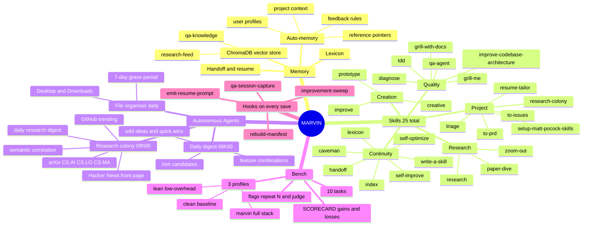

# MARVIN

> *"I could calculate your chances of survival, but you won't like it."*
> — Marvin, The Hitchhiker's Guide to the Galaxy

**MARVIN** is an open-source memory, routing, and skills layer for [Claude Code](https://claude.ai/code). Where Claude starts every session cold, MARVIN gives it persistent memory, 25 structured skills, autonomous background agents, and a self-measuring bench — so it finds the right knowledge, applies the right skill, and gets measurably better over time.

Named after the Hitchhiker's Guide's brilliant, underutilised android. This project is about making sure that brain gets used.

> **North star:** minimise token cost, maximise capability and quality. Every component earns its place through measurement, not intuition.

---

## What MARVIN Can Do



---

## Skills — Complete List

All 25 skills, their triggers, and what they do:

| Skill | Trigger | What it does |
|-------|---------|-------------|
| `diagnose` | Bug reported, broken/throwing/failing, perf regression | Root-cause analysis — traces symptom → cause → fix |
| `tdd` | "TDD", "red-green-refactor", test-first | Writes failing tests first, then drives implementation to pass |
| `qa-agent` | "qa", "scan project", "best practices for X" | AST + text quality scan; appends lessons to ChromaDB `qa-knowledge` |
| `grill-me` | "Grill me", stress-test a plan | Devil's advocate — challenges assumptions and finds hidden failure modes |
| `grill-with-docs` | Stress-test plan against project docs | Same as grill-me but cross-references actual docs and ADRs |
| `improve-codebase-architecture` | "Improve architecture", "reduce coupling" | Structural refactor with an eye on testability and cohesion |
| `research` | "Research X", investigate claim, evaluate technology | Tiered source lookup: arXiv → Semantic Scholar → official docs → web |
| `paper-dive` | `/paper-dive`, PDF path or paper URL | Walks through a research paper — findings, method, relevance to MARVIN |
| `zoom-out` | Unfamiliar with code area, "give me the map" | Produces a high-level architectural map of the code area |
| `creative` | "Be creative", ideation, "surprise me" | Generative ideation with cross-domain pattern retrieval |
| `prototype` | "Prototype", "mock up UI", "try a few designs" | Rapid sketch mode — speed over polish, multiple variants |
| `improve` | "Show improvement queue", "run daily digest" | Surfaces the improvement queue and/or triggers the daily digest |
| `handoff` | Auto before context switch or topic shift | Writes a resume prompt to `~/.claude/handoffs/`; surfaces it as a code block |
| `index` | Task start (auto) | Matches task keywords to `manifest.json` tags to load only relevant skills |
| `self-improve` | Explicit `/self-improve` request | Identifies a pattern worth preserving and writes it to memory |
| `self-optimize` | Auto every 3–5 sessions or when CLAUDE.md > 80 lines | Audits CLAUDE.md for bloat; appends suggestions to `~/.claude/suggestions.md` |
| `write-a-skill` | "Create a new skill", "write a skill" | Scaffolds a new `SKILL.md` with correct frontmatter and routing entry |
| `caveman` | "Caveman mode", "less tokens", `/caveman` | Switches to minimal-prose responses for token-tight situations |
| `lexicon` | New concept crystallises, "add to lexicon" | Adds a term + definition to `~/.claude/lexicon.md` |
| `research-colony` | "Show research digest", "what's new in AI", "any new papers" | Runs or displays the research colony pipeline |
| `setup-matt-pocock-skills` | First use in a new repo | Activates triage, to-issues, to-prd for the current project |
| `triage` | (activated by setup-matt-pocock-skills) | Triages issues and priorities for a project |
| `to-issues` | (activated by setup-matt-pocock-skills) | Converts tasks/TODOs into GitHub issues |
| `to-prd` | (activated by setup-matt-pocock-skills) | Drafts a product requirements document from a feature description |
| `resume-tailor` | "Tailor my resume", "apply for X" | Tailors master resume to a job description; local-only, never commits |

---

## Capability Areas

### Memory
Four persistent memory types across sessions: **user** (role, preferences, expertise), **feedback** (corrections and confirmed approaches), **project** (goals, deadlines, constraints), **reference** (pointers to external systems). Stored as Markdown files, indexed in ChromaDB for semantic retrieval.

Two ChromaDB collections: `qa-knowledge` (lessons learned from all past sessions) and `research-feed` (external research, populated daily by the research colony).

### Autonomous Agents
Three launchd cron jobs run without intervention:

| Agent | Time | Output |
|-------|------|--------|
| **Daily digest** | 08:30 | `~/.claude/daily-digest/YYYY-MM-DD.md` — feature combinations, trim candidates, wild idea, quick win |
| **Research colony** | 09:00 | `~/.claude/research-digest/YYYY-MM-DD.md` — directly relevant, lateral finds, tools/repos, skip list |
| **File organiser** | Daily | Sorts Desktop + Downloads into `~/Documents` buckets; 7-day grace period keeps new items visible |

### marvin-bench — objective A/B testing
10 tasks run across three profiles with four metrics: token cost, tool efficiency, task correctness (substring + LLM judge), and recall quality.

```bash
python3 bench/bench.py bench/tasks/*                  # full suite, both profiles
python3 bench/bench.py bench/tasks/* --repeat 5       # mean ± σ across 5 runs
python3 bench/bench.py bench/tasks/* --judge          # LLM semantic grading
python3 bench/bench.py bench/tasks/* --profiles lean  # specific profile only
```

See [`bench/SCORECARD.md`](bench/SCORECARD.md) for honest results — gains *and* setbacks at equal weight.

### PostToolUse Hooks
Four hooks fire on every Write or Edit:

| Hook | What it does |
|------|-------------|
| `rebuild-manifest` | Keeps `manifest.json` tag index current |
| `emit-resume-prompt` | Writes session resume prompt to `~/.claude/handoffs/` |
| `qa-session-capture` | Appends lessons to `qa-knowledge` ChromaDB |
| `improvement-sweep` | Scans changed project; appends top 5 issues to `improvement-queue.md` |

---

## Architecture

```
Your request
     │
     ▼
 manifest.json       ← flat tag index (domain:, intent:, type:)
     │
     ▼
 ChromaDB            ← 768-dim vectors via nomic-embed-text
     │  cosine similarity
     ▼
 BM25 re-rank        ← keyword overlap on top candidates
     │  RRF merge
     ▼
 Loaded context      ← only what this task needs, nothing more
     │
     ▼
  Claude Code
```

Skills live in `~/.agents/skills/`. Each is a `SKILL.md` with YAML frontmatter tags. Memory files live in `~/.claude/projects/*/memory/`. Both feed the same manifest and vector store.

---

## Quick Start

```bash
git clone https://github.com/G-Eskayo/marvin.git
cd marvin
chmod +x setup.sh
./setup.sh
```

Open Claude Code and start a new session. MARVIN loads silently.

Install the autonomous agents:
```bash
bash ~/.agents/skills/improve/install.sh          # daily digest at 08:30
bash ~/.agents/skills/research-colony/install.sh  # research colony at 09:00
```

---

## What Gets Installed

```
~/.agents/
├── skills/                        ← 25 skill SKILL.md files + scripts
│   ├── self-improve/scripts/      ← manifest rebuild, embeddings, retrieval
│   ├── improve/scripts/           ← improvement sweep, daily digest, cron
│   ├── research-colony/scripts/   ← source monitor, correlate, digest, cron
│   └── qa-agent/scripts/          ← QA scanner, session capture, KB query
├── bench/                         ← marvin-bench A/B harness
│   ├── bench.py
│   ├── tasks/                     ← 10 tasks (task-001 … task-010)
│   ├── SCORECARD.md
│   └── profiles/                  ← clean / lean / marvin config dirs
└── venv/                          ← Python virtualenv (chromadb, rank_bm25)

~/.claude/
├── CLAUDE.md                      ← Global instructions + routing table
├── lexicon.md                     ← Shared vocabulary
├── manifest.json                  ← Generated tag index (do not edit)
├── chroma/                        ← ChromaDB (qa-knowledge + research-feed)
├── handoffs/                      ← Session resume prompts
├── daily-digest/                  ← YYYY-MM-DD.md brainstorm digests
├── research-digest/               ← YYYY-MM-DD.md research colony digests
├── research-feed/                 ← Raw fetch cache (JSON per day)
├── improvement-queue.md           ← Live issue backlog
└── settings.local.json            ← 4 PostToolUse hooks
```

---

## Prerequisites

- **[Claude Code](https://claude.ai/code)** — CLI or desktop app
- **Anthropic API key** — set as `ANTHROPIC_API_KEY`
- **Python 3.9–3.12** — Python 3.14+ not supported (libexpat ABI mismatch on macOS)
- **~600 MB disk** — 274 MB nomic-embed-text + ChromaDB + deps
- **Ollama** — installed by `setup.sh`; required for embeddings, offline after first pull

---

## Platform Compatibility

| Platform | Status | Notes |
|---|---|---|
| macOS ARM (M1–M4) | ✅ Recommended | Ollama uses Metal; embeddings ~8s/100 files |
| macOS Intel | ✅ Full support | — |
| Ubuntu / Debian x86_64 | ✅ Full support | Use Python 3.11 from apt |
| Fedora / RHEL x86_64 | ✅ Full support | Use Python 3.11 from dnf |
| Linux ARM (Raspberry Pi 5+) | ⚠️ Partial | Works; ~5s/file. 4 GB RAM min |
| Windows WSL2 | ✅ Full support | Run `setup.sh` inside WSL2 |
| Windows native | ❌ Not supported | Hooks require bash + POSIX paths |

---

## Adding Your Own Skills

```markdown
---
name: my-skill
description: One-line description
tags: [domain:my-domain, intent:my-intent, type:skill]
---

# My Skill

Instructions for Claude here...
```

Drop it in `~/.agents/skills/my-skill/SKILL.md`. The PostToolUse hook picks it up on the next save. To wire it to a slash command, add a row to the routing table in `~/.claude/CLAUDE.md`.

---

## AI Disclosure

Built collaboratively with Claude (claude-sonnet-4-6 via Claude Code).

| Component | AI involvement |
|---|---|
| All skill SKILL.md files | Authored by AI, reviewed by human |
| All Python scripts | Designed and written by AI |
| `setup.sh` | AI, from human-specified platform requirements |
| Architecture decisions | Grilled and validated by human |
| `CLAUDE.md` / `lexicon.md` | Collaboratively authored |
| README | AI |

**What the human contributed:** the core concept (selective context loading), all architectural decisions, platform requirements and testing, the name.

**Note:** tested on macOS ARM. Linux and WSL2 cross-platform behaviour has not been tested end-to-end. Open an issue if something breaks.

---

## Contributing

PRs welcome:
- New skills (`SKILL.md` + PR)
- Linux / WSL2 testing and bug reports
- Hard bench tasks (tasks where `clean` scores ≤ 0.50)
- Windows native support (PowerShell setup script)

---

## License

MIT. See `LICENSE`.

---

*MARVIN: "I could calculate your chances of survival, but you won't like it."*
*You: "Just load the relevant context."*
*MARVIN: "Done."*
