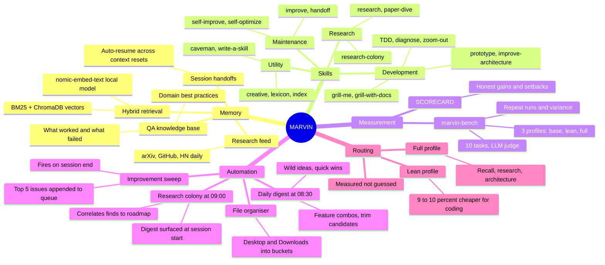

# MARVIN

> *"I have a brain the size of a planet and they ask me to take them to the bridge."*
> — Marvin, The Hitchhiker's Guide to the Galaxy

**MARVIN** is a persistent, self-improving AI partner built on top of [Claude Code](https://claude.ai/code). Where Claude starts every session cold, MARVIN remembers what worked, routes the right skills to the right tasks, runs background agents while you sleep, and measures its own gains with an honest A/B bench.

Named after the Hitchhiker's Guide's brilliant, underutilised android. This project is about making sure that brain gets used.

---

## What MARVIN Can Do



---

## Five Pillars

| Pillar | What it does |
|---|---|
| **Memory & retrieval** | ChromaDB hybrid search (BM25 + nomic-embed-text vectors) loads only what the current task needs. QA knowledge base stores 63+ domain best-practices across sessions. Research feed captures daily arXiv/GitHub/HN finds correlated to your work. |
| **Skill system** | 20+ structured instruction sets Claude invokes by context — TDD, debugging, architecture review, research, ideation, and more. Each skill is an auditable Markdown file. |
| **Bench harness** | `marvin-bench` A/B tests three profiles (base, lean, full) across 10 tasks. Metrics: pass rate, token cost, tool calls. LLM-as-judge grading. Repeat runs with variance. Results in `bench/SCORECARD.md`. |
| **Automation agents** | Three daily launchd agents: improvement sweep (session end → top 5 issues), brainstorm digest (08:30 → feature ideas), research colony (09:00 → correlated external finds synthesised by Claude). |
| **Profile routing** | `lean` profile strips MARVIN overhead for mechanical coding — measured 9–10% token saving, zero recall regression. `full` for recall/research/architecture. Evidence-based, not guessed. |

---

## Quick Start

```bash
git clone https://github.com/G-Eskayo/marvin.git
cd marvin
chmod +x setup.sh
./setup.sh
```

Open Claude Code and start a new session. MARVIN loads silently.

**Prerequisites:** Claude Code (free tier works) · Python 3.9–3.12 · ~600 MB disk · internet at setup only

---

## Architecture

```
Your request
     │
     ▼
 manifest.json         ← flat index of all skills + knowledge
     │  tags[]
     ▼
 Tag filter            ← namespace:value matching (domain:, intent:, type:)
     │
     ▼
 ChromaDB              ← 768-dim vectors via nomic-embed-text
     │  cosine similarity
     ▼
 BM25 re-rank          ← keyword overlap on candidates
     │  RRF merge
     ▼
 Loaded context        ← only what this task needs
     │
     ▼
  Claude Code
```

**PostToolUse hook chain** — fires on every Write/Edit:

```
rebuild-manifest.py → emit-resume-prompt.py → qa_session_capture.py → improvement_sweep.py
```

---

## What Gets Installed

```
~/.agents/
├── bench/                     ← marvin-bench A/B harness
│   ├── bench.py               ← runner (--repeat N, --judge)
│   ├── SCORECARD.md           ← honest gains + setbacks
│   └── tasks/                 ← 10 task definitions
├── skills/                    ← 20+ skill SKILL.md files
│   ├── diagnose/
│   ├── handoff/
│   ├── improve/               ← daily digest + improvement sweep
│   │   └── scripts/
│   │       ├── daily_digest.py
│   │       └── improvement_sweep.py
│   ├── qa-agent/              ← QA knowledge base + AST/comment scanner
│   ├── research-colony/       ← source monitor + correlate + digest
│   │   └── scripts/
│   │       ├── source_monitor.py
│   │       ├── correlate.py
│   │       └── research_digest.py
│   ├── tdd/
│   └── ...
└── venv/                      ← Python virtualenv (chromadb, rank_bm25)

~/.claude/
├── CLAUDE.md                  ← Global Claude instructions + routing table
├── manifest.json              ← Generated index (do not edit by hand)
├── chroma/                    ← ChromaDB vector store
│   ├── qa-knowledge           ← 63+ domain entries
│   └── research-feed          ← daily research items
├── daily-digest/              ← YYYY-MM-DD.md brainstorm files
├── research-digest/           ← YYYY-MM-DD.md research finds
├── improvement-queue.md       ← rolling top-5 issues
└── settings.local.json        ← PostToolUse hook chain
```

---

## Bench Results

`bench/SCORECARD.md` gives the full honest picture with gains and setbacks at equal weight.

| Metric | How |
|---|---|
| Pass rate | Substring match + LLM-as-judge (claude grades the output) |
| Token cost | `tok/ok` — tokens per correct answer |
| Tool efficiency | `tools/ok` — tool calls per correct answer |
| Variance | `--repeat N` shows mean ± σ; don't trust magnitudes below 3× σ |

**Headline:** MARVIN wins on recall tasks (−52% tokens, −46% tool calls on task-002). Lean profile cuts mechanical coding cost 9–10%. A ~8–10% overhead tax exists on pure coding tasks that need no recall — profile routing is the fix.

---

## Platform Compatibility

| Platform | Status |
|---|---|
| macOS ARM (M1–M4) | ✅ Full support — GPU via Metal, recommended |
| macOS Intel | ✅ Full support |
| Ubuntu / Debian x86_64 | ✅ Full support |
| Fedora / RHEL x86_64 | ✅ Full support |
| Linux ARM (Pi 5+) | ⚠️ Works, slow embedding (~5s/file), 4 GB RAM min |
| Windows WSL2 | ✅ Full support — run setup.sh inside WSL2 |
| Windows native | ❌ Use WSL2 — hook system requires bash |

> **Python 3.14+ not compatible.** A `libexpat` ABI mismatch on macOS 14–15 causes pip to crash. Use 3.9–3.12. The setup script detects this automatically.

---

## Adding Skills

Every skill is a `SKILL.md` in `~/.agents/skills/<skill-name>/`:

```markdown
---
name: my-skill
description: One-line description
tags: [domain:my-domain, intent:my-intent, type:skill]
---

Instructions for Claude here...
```

The PostToolUse hook rebuilds the manifest and re-embeds on every save.

---

## Known Limitations

- **No contradiction detection** — MARVIN does not flag when two knowledge files disagree
- **No staleness expiry** — files do not expire; keep knowledge current manually
- **Embedding truncation** — files > ~4000 chars are truncated; first 4000 chars carry highest-signal content
- **Colony rate limits** — default fetch is 15 arXiv papers/day; do not increase without adding `time.sleep`

---

## AI Disclosure

Built collaboratively with claude-sonnet-4-6 via Claude Code. Human contributions: the core concept (selective context loading), all architecture decisions, naming, and bench measurement design. AI contributions: code, skill files, README, tests. Every architectural choice was grilled before shipping — see `grill-with-docs` skill.

---

## Contributing

PRs welcome: new skills · Linux/WSL2 testing · staleness detection design · Windows native support

## License

MIT. See `LICENSE`.

---

*MARVIN: "I could calculate your chances of survival, but you won't like it."*
*You: "Just load the relevant context."*
*MARVIN: "Done."*
