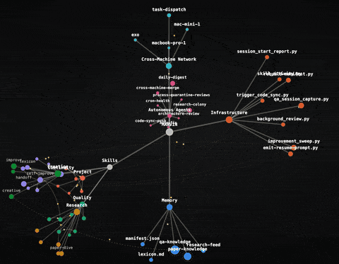
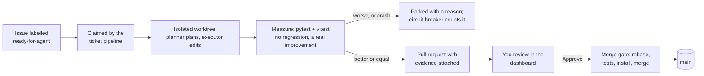
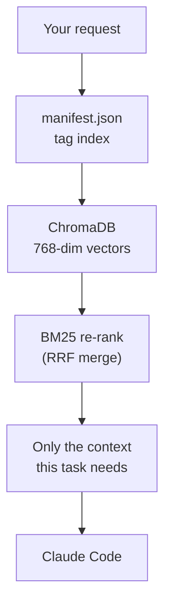
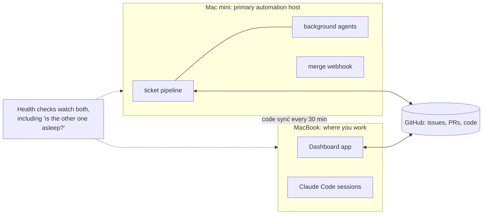

# MARVIN

> *"I could calculate your chances of survival, but you won't like it."*: Marvin, The Hitchhiker's Guide to the Galaxy

**MARVIN gives [Claude Code](https://claude.ai/code) a memory, a set of skills, and a way to keep working while you are away.** Claude starts every session cold; MARVIN loads only the context a task needs, applies the right skill, runs on the cheapest model that passes the bench, and ships small changes through a gated pipeline that you review from a dashboard.

**Status:** in daily use by its author on two Macs (a primary automation host and a laptop). macOS is the supported platform; Linux and WSL2 run the memory and skills layer but are untested end to end. The dashboard and the background agents are macOS-only (launchd, Electron).

<p align="center">
  
</p>

*Above: MARVIN's real structure, generated from `manifest.json` (one node per skill, hook and memory type; gold pulses are real calls). It is a recorded loop; the live version is `brain-map/index.html`.*

## Contents

[What it does](#what-it-does) · [See it work](#see-it-work) · [How it works](#how-it-works) · [Quickstart](#quickstart) · [Docs map](#docs-map) · [Platforms](#platforms) · [Contributing](#contributing)

## What it does

| | |
|---|---|
| **Memory** | Four kinds of memory (user, feedback, project, reference) plus three ChromaDB collections, retrieved by meaning and keyword so a session starts with what it needs and nothing more. |
| **32 skills** | Debugging, TDD, research, architecture review, handoffs, README writing and more, each a `SKILL.md` Claude loads on demand. [Full list](docs/skills.md). |
| **A gated ticket pipeline** | Issues labelled `ready-for-agent` are worked in an isolated worktree, measured against the repo's own tests, and raised as pull requests with evidence. Nothing merges until you approve it. |
| **A dashboard** | An Electron app with tabs for metrics, MR review, health, docs, activity boards and a portfolio site manager. |
| **Background agents** | launchd jobs for a daily digest, a research colony, health checks, code sync between machines, and an auto-fixer limited to safe changes. |
| **A bench** | `marvin-bench` A/B tests configurations (clean, lean, full) on token cost and correctness, so every "this is better" claim has a number behind it. [Scorecard](bench/SCORECARD.md). |

## See it work

**Routing: the cheapest model that passes.** Real output, 2026-10-05:

```text
$ route "what were the bench results last session?"
intent:    recall  (embed match, score 0.8075)
profile:   marvin
model:     claude-haiku-4-5-20251001
savings:   ~60% vs MARVIN + Sonnet
why:       Memory retrieval — MARVIN's ChromaDB holds the answer. Haiku handles recall at ~60% Sonnet cost (bench Run 8).
alias:     claude-recall
```

**Health: one command tells you what is wrong.** Real output (abridged):

```text
$ ~/.agents/venv/bin/python lib/health_checks.py
overall: yellow  coverage: 5/18
  [ green] Auth token: gh-token: present, 40 chars, no whitespace
  [ green] route.py embedding classifier (ChromaDB): 92 reference examples indexed
  [ green] Local dispatch lock: idle
```

**The pipeline: how a change gets made while you are away.**


```mermaid
flowchart LR
  I["Issue labelled<br/>ready-for-agent"] --> C["Claimed by the<br/>ticket pipeline"]
  C --> W["Isolated worktree:<br/>planner plans, executor edits"]
  W --> M["Measure: pytest + vitest<br/>no regression, a real improvement"]
  M -->|worse, or crash| P["Parked with a reason;<br/>circuit breaker counts it"]
  M -->|better or equal| R["Pull request with<br/>evidence attached"]
  R --> D["You review in the<br/>dashboard"]
  D -->|Approve| G["Merge gate: rebase,<br/>tests, install, merge"]
  G --> Main[("main")]
```

Every failure is recorded with a cause, and the same failure on three different tickets pauses dispatch instead of repeating ([circuit breaker](lib/failure_breaker.py)).

## How it works

**A session's context** is chosen, not dumped: a tag manifest narrows the skills, vector search finds the memories, a keyword pass re-ranks, and only the result is loaded.


```mermaid
flowchart TB
  Q["Your request"] --> T["manifest.json<br/>tag index"]
  T --> V["ChromaDB<br/>768-dim vectors"]
  V --> B["BM25 re-rank<br/>(RRF merge)"]
  B --> X["Only the context<br/>this task needs"]
  X --> CC["Claude Code"]
```

**The system around it** runs on two Macs that keep each other in step:


```mermaid
flowchart LR
  subgraph Mini["Mac mini: primary automation host"]
    TP["ticket pipeline"] --- AG["background agents"]
    WH["merge webhook"]
  end
  subgraph Lap["MacBook: where you work"]
    DB["Dashboard app"]
    CC2["Claude Code sessions"]
  end
  GH[("GitHub: issues, PRs, code")]
  TP <--> GH
  DB <--> GH
  Mini <-->|"code sync every 30 min"| Lap
  HC["Health checks watch both,<br/>including 'is the other one asleep?'"] -.-> Mini
  HC -.-> Lap
```

Design decisions are written down as [ADRs](docs/adr/) as they are made; the live design of each subsystem is in [`CONTEXT.md`](CONTEXT.md).

## Quickstart

macOS, with [Claude Code](https://claude.ai/code) installed and signed in (the memory and skills layer also runs on Linux and WSL2).

```bash
git clone https://github.com/G-Eskayo/marvin.git
cd marvin
./setup.sh
```

`setup.sh` creates the Python environment (3.9 to 3.12), installs Ollama and pulls the `nomic-embed-text` embedding model (about 274 MB), builds the ChromaDB collections and installs the hooks. Open Claude Code and start a new session; MARVIN loads on its own.

Optional pieces, each independent (macOS):

```bash
bash ~/.agents/skills/improve/install.sh          # daily digest at 08:30
bash ~/.agents/skills/research-colony/install.sh  # research colony at 09:00
bash ~/.agents/skills/route/install.sh            # claude-recall / claude-code / claude-arch aliases
bash ~/.agents/brain-map/install.sh               # live architecture map as desktop wallpaper (needs Swift)
cd ~/.agents/dashboard && npm install && npm run dev   # the dashboard, in development mode
```

To check an install worked, open `~/.agents/brain-map/index.html`: every skill you installed should be a node.

**Add a skill:** a folder under `~/.agents/skills/` with a `SKILL.md` (frontmatter `name`, `description`, `tags`). The save hook picks it up; add a row to the routing table in `~/.claude/CLAUDE.md` to wire a slash command. The `write-a-skill` skill scaffolds one.

## Docs map

| You want | Read |
|---|---|
| The current design of each subsystem (pipeline, health, dashboard, portfolio, sync...) | [`CONTEXT.md`](CONTEXT.md) |
| Why a decision was made | [`docs/adr/`](docs/adr/) |
| What each skill does | [`docs/skills.md`](docs/skills.md) (generated from the skills) |
| Evidence the system works (bench runs, real bugs found) | [`docs/impact.md`](docs/impact.md), [`bench/SCORECARD.md`](bench/SCORECARD.md) |
| How READMEs here are judged | [`docs/readme-criteria.md`](docs/readme-criteria.md), latest [audit](docs/readme-audit-2026-10-05.md) |
| The start-of-session checklist | [`docs/session-start-checklist.md`](docs/session-start-checklist.md) |
| Security rules (what must never be committed) | [`SECURITY.md`](SECURITY.md) |

## Platforms

| Platform | Memory and skills | Dashboard and background agents |
|---|---|---|
| macOS Apple Silicon | Used daily (the author's setup) | Used daily |
| macOS Intel | Expected to work, untested | Expected to work, untested |
| Linux, WSL2 | Written to work, untested end to end | Not supported (launchd, Electron app) |
| Windows native | Not supported (hooks need bash and POSIX paths) | Not supported |

Tested on macOS ARM only. If something breaks elsewhere, please open an issue.

## Contributing

Pull requests are welcome: new skills (a `SKILL.md` plus a PR), Linux and WSL2 testing, hard bench tasks (ones where the `clean` profile scores 0.50 or less), and a PowerShell setup for Windows. Run the tests first:

```bash
~/.agents/venv/bin/python -m pytest lib/tests -q     # Python (about 900 tests)
cd dashboard && npx vitest run                       # dashboard (about 490 tests)
```

## AI disclosure

Built collaboratively with Claude through Claude Code. The skills, scripts, `setup.sh` and this README were written by Claude and reviewed by the author; the concept (selective context loading), the architecture decisions, the platform requirements and the name are the author's. See [`ACKNOWLEDGEMENTS.md`](ACKNOWLEDGEMENTS.md) for the work this builds on.

## License

MIT. See [`LICENSE`](LICENSE).
